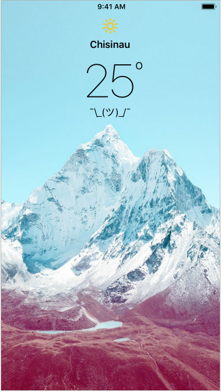
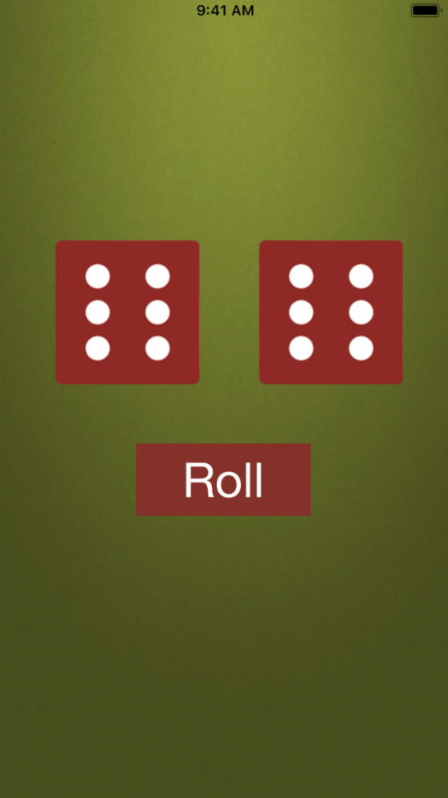

# All projects:

 

## Clima

Weather app, gettings GPS from users device and then using it for parsing JSON data for the weather

 

## Weathery

Simple weather app for parsing JSON data

 

## Quizzler

Quizz app (Worked on pop-ups, and alert view)

 

## Dicly

Generate 2 random numbers and represent those as dices

 

